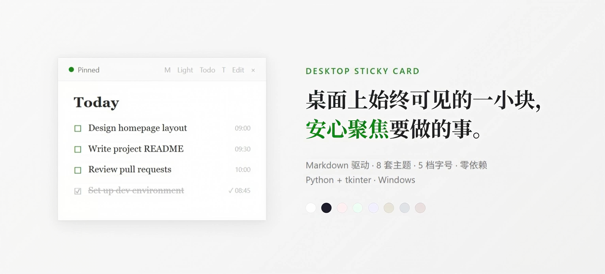
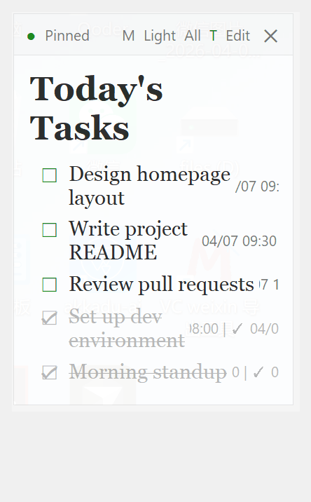

# Desktop Sticky Card



## 解决什么问题

待办工具都需要主动打开才能看到。一旦需要"想起来才去看"，它就失去了锚点的意义。

Desktop Sticky Card 是一个始终悬浮在桌面上的待办卡片——不需要切换窗口，余光就能扫到接下来要做的事，随时确认自己的节奏和位置。

## 特性

- **桌面置顶** — 悬浮在所有窗口之上，始终可见（可切换）
- **点击勾选** — 直接在卡片上点击任务切换完成状态，自动记录完成时间
- **All / Todo 视图** — 一键切换，展开全部或只看未完成
- **8 套主题** — Light / Dark / 马卡龙（Rose / Mint / Lavender）/ 莫兰蒂（Green / Blue / Rose）
- **5 档字号** — XS / S / M / L / XL
- **可调大小** — 拖拽边缘调整宽高
- **卡片上直接编辑** — 点 Edit 进入编辑模式，Ctrl+S 保存，Esc 取消
- **可折叠分区** — `##` 标题点击可展开/收起，适合放 OKR、目标、备忘等长内容
- **标签系统** — 任务加 `#标签名` 分类，筛选栏一键过滤，标签 badge 可显示/隐藏
- **时间戳** — 创建时间自动记录，可一键显示/隐藏
- **对话终端** — 直接打字添加任务，支持 `1.xxx；2.xxx` 批量录入
- **文件驱动** — 内容就是 `card-content.md`，任何编辑器都能改
- **高 DPI 支持** — Per-Monitor DPI 感知，文字清晰锐利
- **状态自动保存** — 窗口位置、大小、主题、字号、显示偏好全部持久化
- **零依赖** — 仅 Python 标准库 tkinter

## 快速启动

```bash
# 首次使用：复制示例文件
cp card-content.example.md card-content.md
cp card-tags.example.json card-tags.json

# 启动
双击 start.bat
```

同时启动桌面卡片 + 对话终端。



在终端里直接打字就能操作：

```
> 写周报
  ✓ 已添加: 写周报

> 1.买菜；2.做饭；3.洗碗
  ✓ 已添加: 买菜
  ✓ 已添加: 做饭
  ✓ 已添加: 洗碗

> 完成 1
  ✓ 完成: 写周报

> 帮助
  （查看所有命令）
```

也可以双击 `sticky-card.pyw` 单独启动卡片，用 Edit 模式或任何编辑器修改 `card-content.md`。

## 卡片顶栏

| 按钮 | 功能 |
|------|------|
| ● Pinned | 切换置顶/非置顶 |
| XS/S/M/L/XL | 字号 |
| Light/Dark/... | 主题 |
| All / Todo | 全部 / 只看未完成 |
| Tag | 显示/隐藏任务行内标签 |
| T | 显示/隐藏时间戳 |
| Edit | 编辑模式（Ctrl+S 保存，Esc 取消） |
| ✕ | 关闭 |

## 文件结构

```
├── card-content.md         # 卡片内容（Markdown，编辑即生效）
├── card-tags.json          # 标签配置（自定义，首次从 example 复制）
├── card-tags.example.json  # 标签配置模板
├── sticky-card.pyw         # 卡片 GUI
├── cardlib.py              # 共享库
├── chat.py                 # 对话终端
├── card.py                 # CLI 工具
├── start.bat               # 一键启动：卡片 + 对话终端
├── chat.bat                # 单独启动对话终端
├── card.bat                # CLI 入口
├── .card-state.json        # 显示偏好（自动生成）
├── README.md
└── CHANGELOG.md
```

## Markdown 语法

| 语法 | 效果 |
|------|------|
| `# Title` | 大标题 |
| `## Title` | 可折叠分区（点击展开/收起） |
| `### Title` | 小标题 |
| `- [ ] Task` | 未完成任务 ☐ |
| `- [x] Task` | 已完成任务 ☑ |
| `- Item` | 列表项 |
| `---` | 分隔线 |
| `- [ ] Task #Tag` | 带标签的任务 |
| `*text*` | 斜体 |

## 标签

在 `card-tags.json` 中定义标签名，任务中用 `#标签名` 标记：

```json
{
  "tags": ["Work", "Personal", "Study", "Health"]
}
```

```markdown
- [ ] Review pull requests #Work
- [ ] Read chapter 5 #Study
```

卡片顶部会出现标签筛选栏，点击可按类别过滤任务。顶栏 Tag 按钮控制行内标签 badge 的显示/隐藏。标签颜色跟随当前主题自动切换。

## 可折叠分区

`##` 标题可以点击展开/收起，适合放目标、OKR、备忘等不需要时刻展示的内容：

```markdown
## Goals
- Revenue: $10,000 MRR
- Users: 5,000 WAU

## Sprint
- [ ] Design homepage #Work
- [ ] Fix login bug #Work
```

点击 `▼ Goals` 可收起该区域，变为 `▶ Goals`。折叠状态自动保存。分区范围从 `##` 标题开始，到下一个 `#`、`##` 或 `---` 结束。

## 环境要求

- Python 3.8+（需含 tkinter，Windows 默认包含）
- Windows 10/11

## License

MIT
